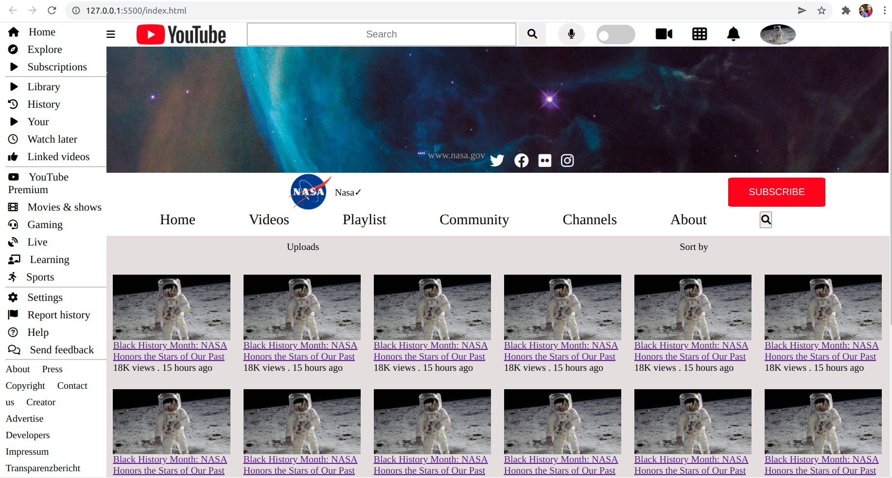

## NASA Youtube-practice

**[https://sgujuluva.github.io/youtube-clone/](github.io)**

---

#### Navigation

- About Project
  - _This my practice project of replicating NASA- youtube site._
  - _Developed With HTML and CSS _

- Used Tools
  - _Fonts_
  - _Design_
  - _Icons_
  - _Colors_

---

### About Project

Replicating the Youtube website of NASA with banner images, images , aside bar , navbar and menu items.

##### Developed With

- [x] _HTML5_
- [x] _CSS3_
- [ ] _SASS_
- [ ] _SCSS_
- [ ] _JavaScript_
- [ ] _React_
- [ ] _Bootstrap_
- [ ] _npm_

---

### Contact

Mail: <sanghee04@gmail.com.com> 
GitHub: [sgujuluva](https://github.com/) 

---

### Used Tools

- [icons](https://fontawesome.com)
- [Canva](https://www.canva.com/)
- [Google Fonts](https://fonts.google.com/)
- [Visual Studio Code](https://code.visualstudio.com/)
- [ColorZilla](https://www.colorzilla.com/chrome/)

---

Made with ❤️ by Sangeetha

